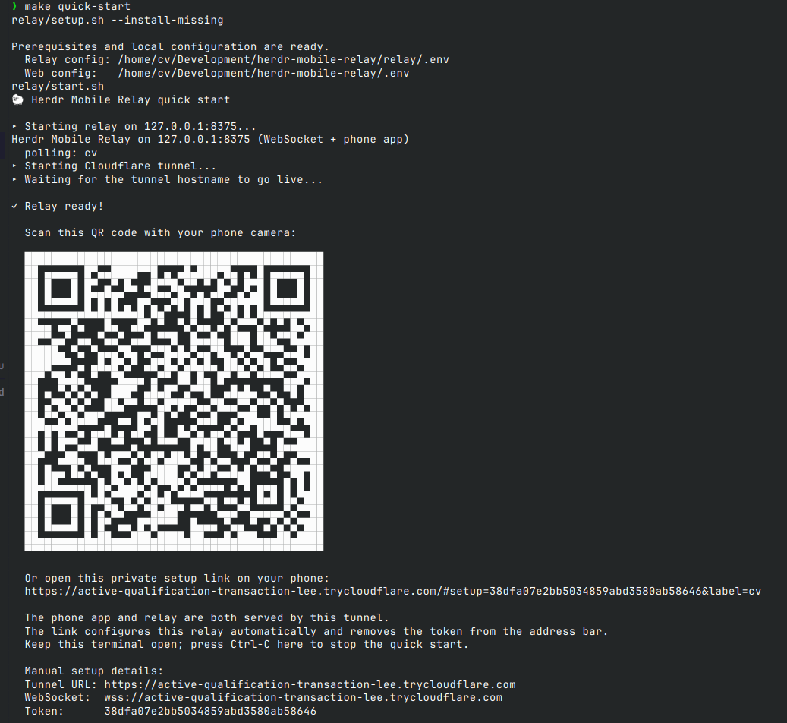

# Herdr Mobile Relay Quick Start

This is the beginner path. It gets one Linux or macOS computer connected to one phone before asking you to configure permanent domains or background services.

> [!IMPORTANT]
> Windows is not currently supported.

## Before You Start

You need Git, Make, and `curl`. Most developer-oriented Linux and macOS computers already have them. Check with:

```bash
git --version && make --version && curl --version
```

You do **not** need a Cloudflare account, domain, existing Python installation, Node.js, or separately hosted web app for this trial. Cloudflare describes [TryCloudflare quick tunnels](https://developers.cloudflare.com/cloudflare-one/networks/connectors/cloudflare-tunnel/do-more-with-tunnels/trycloudflare/) as free testing tunnels that create temporary random hostnames without moving a domain to Cloudflare.

## 1. Paste One Command

```bash
git clone https://github.com/0cv/herdr-mobile-relay.git && cd herdr-mobile-relay && make quick-start
```

The command:

1. Creates a private relay token and minimal local configuration.
2. Detects Herdr, `uv`, and `cloudflared`.
3. Offers to install anything missing using the tools' official installers or release binaries.
4. Starts the relay and serves the phone app from it.
5. Starts a temporary Cloudflare quick tunnel.

If it asks to install missing tools, type `y` and press Enter. Installation is for your user account; the script does not need `sudo`.

## 2. Scan the QR Code (or Open the Phone Setup Link)

After startup, the terminal shows a QR code and the matching Phone setup link:



Point your phone camera at the QR code and open the link it offers—that is the whole setup. The app opens, saves the relay URL and token, and connects automatically; there is nothing to type or paste into Settings. If the QR code does not appear or does not scan, open the printed HTTPS link on your phone instead—it is the same link.

The token is carried in the URL fragment, which browsers do not send to the server, and the app removes the fragment from the address bar immediately after importing it.

Do not share the setup link or a photo of the QR code: anyone who has both the tunnel URL and token can control agents exposed by that relay.

## 3. Use It

Keep the quick-start terminal open. In another terminal, run Herdr and your normal coding agent, or tap **＋** in the phone app to start an installed Codex, Claude Code, or OpenCode agent in a selected project directory.

The quick tunnel stops when you press Ctrl-C or close its terminal. The next `make quick-start` keeps the same relay token but creates a new random tunnel URL, so scan the newly printed QR code (or open the new link).

## If It Does Not Work

Run the non-installing prerequisite check:

```bash
make setup
```

Common issues:

- **`git`, `make`, or `curl` is missing:** install it with your operating system's package manager, then rerun the one-command quick start.
- **Port 8375 is already in use:** stop the existing relay or service, then rerun the command.
- **The phone link times out:** keep the terminal open and check whether `cloudflared` printed a connectivity error.
- **The link or QR code never loads (site cannot be reached):** some home routers cache a failed DNS lookup for up to 30 minutes if the tunnel hostname is opened before its DNS record goes live. The quick start waits for the hostname to resolve before printing the QR code, so this should be rare. If it still happens, press Ctrl-C and rerun `make quick-start`; each run gets a fresh hostname. Switching the phone to mobile data for the first open also bypasses the router's cache.
- **The app opens but does not connect:** reopen the complete newly printed link, including the `#setup=...` fragment.
- **macOS blocks a project folder:** choose a non-protected project folder or grant the Herdr relay process the appropriate Files and Folders permission.

## Make It Permanent

TryCloudflare quick tunnels are intended for testing, have no uptime guarantee, and change hostname when restarted. For everyday use:

1. Create a Cloudflare account and put a domain on Cloudflare.

   > [!TIP]
   > An available all-numeric `.xyz` domain with 6–9 digits typically costs about $1 per year through Cloudflare Registrar. The `.xyz` registry lists this numeric class at $0.99/year, and Cloudflare sells domains at registry cost without markup. Verify the current price at checkout.

2. Follow the README's [Stable Hostnames](README.md#stable-hostnames) section once per computer.
3. Install the platform background service:

```bash
make service-install
```

4. Add the stable relay to your phone the same way as the quick start:

```bash
make setup-link
```

This prints a QR code and setup link for the stable hostname; scanning it adds the relay to the app automatically.

Repeat the relay setup on each Linux or macOS computer. You can add every stable relay to the same phone app; agents are merged client-side.

## Optional: Host the App Separately

The relay-served app is sufficient for the quick start and stable single-relay setup. For an app origin that remains available independently of any relay—especially with multiple computers—host `web/` on any HTTPS static host. Cloudflare Pages deployment requires a Cloudflare account plus Node.js/npm:

```bash
# Edit WEB_PROJECT in .env first if needed.
make web-deploy
```
