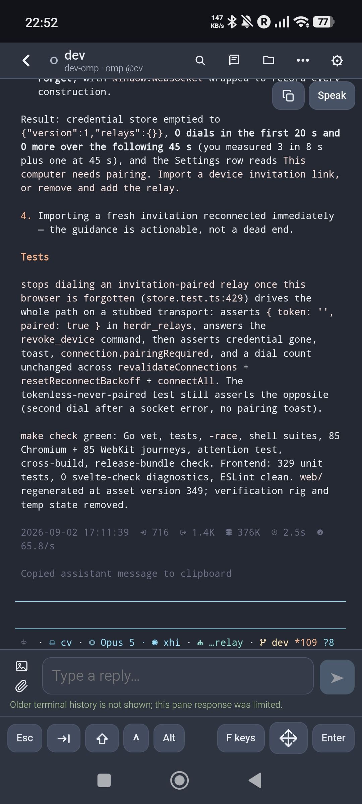
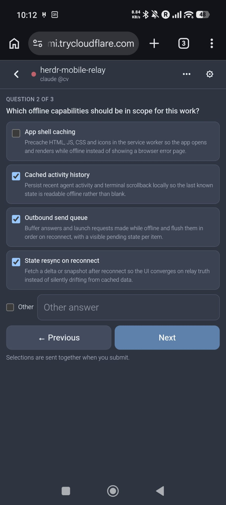
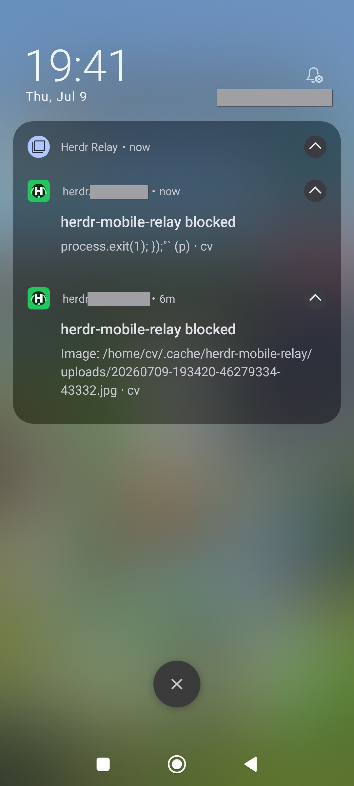

# Herdr Mobile Relay

[](https://github.com/0cv/herdr-mobile-relay/actions/workflows/check.yml)

Control [Herdr](https://herdr.dev) agents from your phone. Each Linux or macOS
computer runs its own relay; the phone connects directly and merges all agents
into one installable web app.

**Current version:** `0.10.1`

> [!IMPORTANT]
> Native Windows is not supported. WSL2 may work but is not tested.

## Install

Requirements: Herdr 0.7.5 or newer, Git, and `curl`.

```bash
herdr plugin install 0cv/herdr-mobile-relay
```

Choose **Quick Start** from the setup menu. If the menu does not open:

```bash
herdr plugin action invoke setup --plugin herdr-mobile-relay.events
```

Quick Start installs missing user-level tools with confirmation, starts the
relay and bundled app, and opens a temporary TryCloudflare tunnel. Scan its QR
code on your phone. Keep the pane open; Ctrl-C stops the relay and tunnel.

No Cloudflare account, domain, Python, Node.js, Go toolchain, separate web
deployment, or `sudo` is required for this trial path. See
[QUICKSTART.md](QUICKSTART.md) for the short walkthrough.

## Stable Setup

For a permanent hostname and background service, add a domain to Cloudflare and
run:

```bash
herdr plugin action invoke install-service --plugin herdr-mobile-relay.events
```

The wizard creates or resumes a dedicated tunnel, checks the DNS route, installs
a user service, verifies the public relay identity, and then prints the private
phone QR. Run it once per computer with a distinct hostname, then add every QR
to the same phone app.

Useful actions:

```bash
herdr plugin action invoke setup-link --plugin herdr-mobile-relay.events
herdr plugin action invoke status --plugin herdr-mobile-relay.events
herdr plugin action invoke configure-app-deploy --plugin herdr-mobile-relay.events
herdr plugin action invoke stable-teardown --plugin herdr-mobile-relay.events
herdr plugin action invoke uninstall --plugin herdr-mobile-relay.events
```

Run `stable-teardown` before uninstall if Cloudflare resources should also be
removed. Full uninstall removes the service, releases, relay state, push
credentials, cache, and plugin registration.

## What It Does

- Monitor and control agents across several computers.
- Start, rename, clear, restart, and stop detected agents.
- Send prompts, terminal keys, slash commands, screenshots, and photos.
- Answer approvals and structured Claude Code or Codex questions.
- Search local activity and receive blocked or completion notifications.
- Require device verification before reconnecting relays.
- Detect Codex, Claude Code, OpenCode, Qoder, and Herdr integrations.

| Agents | Terminal |
| --- | --- |
|  |  |

| Plan Questions | Notifications |
| --- | --- |
|  |  |

The QR imports the relay URL, label, and token. Treat the QR and setup link as
secrets. Enable notifications in the app's Settings; blocked-agent
notifications are included, while completion notifications are optional.

## Updates

The plugin installs a pre-built, checksum- and manifest-verified bundle for the
exact version in `herdr-plugin.toml`. Users never compile the relay. Updates
atomically activate the executable, web app, and runtime wrappers, verify their
exact version, revision, and web hash after restart, and roll back the complete
release if verification fails.

An upgrade from the former 0.8.6 implementation adopts only a validated config
and cache layout. Relay identity, push subscriptions, activity, history,
uploads, and private keys are preserved.

The relay-hosted app updates with its relay. For a separately hosted Cloudflare
Pages app, configure exactly one stable relay as deployment owner with the
`configure-app-deploy` action. That optional role requires Node.js 24 and
Cloudflare credentials on the deployment-owner computer only.

## Local Development

```bash
git clone https://github.com/0cv/herdr-mobile-relay.git
cd herdr-mobile-relay
make dev-tunnel
```

`make dev-tunnel` builds the current Go source and frontend, uses isolated ports
and state under `relay/.dev/`, and opens a temporary tunnel. It never uses the
installed production relay.

Common targets:

```bash
make check             # all backend, frontend, browser, and release checks
make backend-check     # format, vet, tests, race detector, shell checks
make web-release       # replace committed web/ with a verified frontend build
make web-release-check # compare and browser-test the shipped web/ bundle
make relay-plugin      # link this checkout as a Herdr plugin
make stable-setup      # install a checkout-managed stable relay
```

Backend development uses Go 1.26.5; frontend development uses Node.js 24.
Packaged users need neither toolchain.

The test-only `cmd/fake-herdr` binary provides deterministic Herdr CLI behavior,
failure injection, and process-control traces for black-box tests. It is not
included in release archives.

## Runtime and Security

The relay binds to `127.0.0.1:8375`; its event hook uses loopback UDP port 8376.
Cloudflare Tunnel supplies HTTPS/WSS without opening an inbound port. Browser
origins are checked, tokens use constant-time comparison, uploads are limited,
and launch requests cannot provide arbitrary executables or shell commands.

Runtime data stays in the relay's private config and cache roots. The phone
stores its relay list locally. There is no central broker and relays do not
connect to one another.

Health endpoints:

- `GET /health` — process liveness.
- `GET /healthz` — version, revision, web bundle, instance, and inventory state.
- `GET /readyz` — HTTP 200 only after a successful Herdr inventory.

## Troubleshooting

- **No setup menu:** invoke the `setup` action shown above.
- **Port 8375 is busy:** stop the earlier Quick Start or installed service.
- **Temporary URL fails:** keep the pane open and rerun Quick Start for a new
  hostname if `cloudflared` stopped.
- **App opens but stays disconnected:** reopen the complete setup link,
  including its `#setup=...` fragment.
- **Agents are unavailable:** inspect `/healthz`; after a Herdr protocol update,
  run `herdr server live-handoff` and wait for the next relay poll.
- **Stable setup stops:** keep its state and rerun the exact command printed.
- **Need the stable QR:** invoke the `setup-link` action.

## License

Herdr Mobile Relay is licensed under the
[GNU Affero General Public License v3.0 or later](LICENSE).
