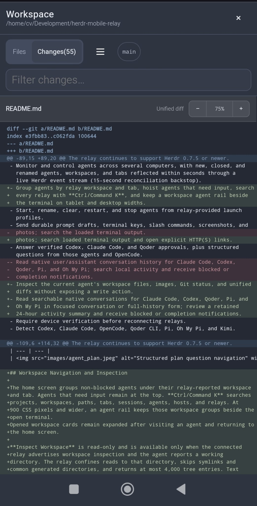
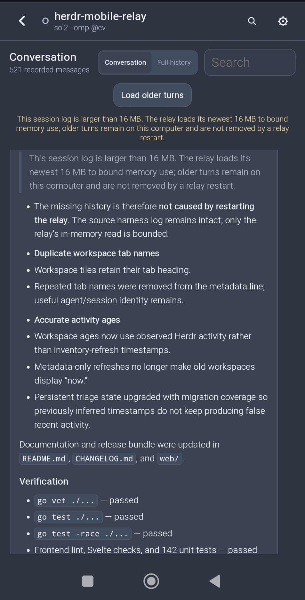

# Herdr Mobile Relay

[](https://github.com/0cv/herdr-mobile-relay/actions/workflows/check.yml)

Control [Herdr](https://herdr.dev) agents from your phone. Each Linux or macOS
computer runs its own relay; the phone connects directly and merges all agents
into one installable web app.

**Current version:** [`0.15.6`](https://github.com/0cv/herdr-mobile-relay/releases/tag/v0.15.6) · [Changelog](CHANGELOG.md)

> [!IMPORTANT]
> Native Windows is not supported. WSL2 may work but is not tested.

## Install

Requirements: Herdr 0.7.5 or newer, Git, and `curl`.

```bash
herdr plugin install 0cv/herdr-mobile-relay
```

Choose **Quick Start** from the setup menu. If the menu does not open:

```bash
herdr plugin action invoke setup --plugin herdr-mobile-relay.events
```

Quick Start installs missing user-level tools with confirmation, starts the
relay and bundled app, and opens a temporary TryCloudflare tunnel. Scan its QR
code on your phone. Keep the pane open; Ctrl-C stops the relay and tunnel.

No Cloudflare account, domain, Python, Node.js, Go toolchain, separate web
deployment, or `sudo` is required for this trial path. See
[QUICKSTART.md](QUICKSTART.md) for the short walkthrough.

## Mobile Onboarding

https://github.com/user-attachments/assets/e52c4fd0-ef77-4852-bb43-078a7154eae8

The walkthrough follows setup from scanning the relay QR through the agent list,
terminal controls, and notification settings. The QR imports the relay URL,
label, and relay key, so treat the QR and setup link as secrets. Enable
notifications in the app's Settings; blocked-agent notifications are included,
while completion notifications are optional.

## Stable Setup

For a permanent hostname and background service, add a domain to Cloudflare and
run:

```bash
herdr plugin action invoke install-service --plugin herdr-mobile-relay.events
```

The wizard creates or resumes a dedicated tunnel, checks the DNS route, installs
a user service, verifies the public relay identity, and then prints the private
phone QR. Run it once per computer with a distinct hostname, then add every QR
to the same phone app.

Useful actions:

```bash
herdr plugin action invoke setup-link --plugin herdr-mobile-relay.events
herdr plugin action invoke status --plugin herdr-mobile-relay.events
herdr plugin action invoke configure-app-deploy --plugin herdr-mobile-relay.events
herdr plugin action invoke stable-teardown --plugin herdr-mobile-relay.events
herdr plugin action invoke uninstall --plugin herdr-mobile-relay.events
```

Run `stable-teardown` before uninstall if Cloudflare resources should also be
removed. Full uninstall removes the service, releases, relay state, push
credentials, cache, and plugin registration.

## Herdr 0.8.0

Herdr 0.8.0 and newer can resume restored agent sessions without a TUI
attached ([#2064](https://github.com/herdrdev/herdr/issues/2064)) and keep the
desktop user's focus when a background workspace closes
([#1328](https://github.com/herdrdev/herdr/issues/1328),
[#1621](https://github.com/herdrdev/herdr/issues/1621)). These upstream
behaviors keep relay startup and phone-driven workspace management
non-disruptive. Phone-driven **Stop** still cascades a single-tab workspace
away; the workspace then reports `workspace_not_found`.

The relay continues to support Herdr 0.7.5 or newer.

## What It Does

- Monitor and control agents across several computers, with new, closed, and
  renamed agents, workspaces, and tabs reflected within seconds through a
  live Herdr event stream (15-second reconciliation backstop).
- Group agents by status and relay workspace: working agents stay visible at
  the top inside their workspace and tab hierarchy, agents that need input
  remain individually actionable, and idle workspaces stay in their own
  section.
- Start, rename, clear, restart, and stop agents from relay-provided launch
  profiles.
- Send durable prompt drafts, terminal keys, slash commands, screenshots, and
  photos; search loaded terminal output and open explicit HTTP(S) links.
- Answer verified Codex, Claude Code, and Qoder approvals, plus structured
  questions from those agents, OpenCode, OMP, and Pi.
- Inspect the current agent's workspace files, images, Git status, and unified
  diffs without exposing a write action.
- Read searchable native conversations for Claude Code, Codex, Qoder, Pi, and
  Oh My Pi in focused conversation or full-history form; review a retained
  24-hour activity summary and receive blocked or completion notifications.
- Require device verification before reconnecting relays.
- Detect Codex, Claude Code, OpenCode, Qoder CLI, Pi, Oh My Pi, and Kimi.

| Agents | Native Resize |
| --- | --- |
|  |  |

| Plan Questions | Notifications |
| --- | --- |
|  |  |

| Git Inspection | Native Conversations |
| --- | --- |
|  |  |

## Workspace Navigation and Inspection

The home screen keeps working agents and agents that need input visible at the
top. Working agents retain their workspace and tab hierarchy; remaining agents
stay in a separate Idle section. On a phone, tap the magnifying-glass button to
search projects, workspaces, paths, tabs, sessions, agents, hosts, and relays.
At 900 CSS pixels and wider, an agent rail keeps those workspace groups beside
the open terminal.

When the relay advertises tab ordering, press and hold an agent card until its
tab lifts, then drag to reorder the tab in Herdr; a plain tap still opens the
agent, and Alt+arrow keys on a focused card provide the same control. The
change is applied to the desktop immediately. Tab moves made on the desktop
arrive through the Herdr event stream and update the mobile order.

Opened workspace cards remain expanded after visiting an agent and returning to
the home screen.

**Inspect Workspace** is read-only and is available only when the connected
relay advertises workspace inspection and the agent reports a working
directory. The relay confines reads to that directory, skips symlinks and
common generated directories, and returns at most 4,000 tree entries. Text
previews are limited to 1 MiB and image previews to 5 MiB.

Git inspection disables hooks, pagers, text conversion, external diffs, lazy
fetches, and user/system Git configuration. Status is limited to 2,000 changed
files, individual unified diffs to 1 MiB, and Git commands to eight seconds.
The inspector has no save, stage, commit, or shell control.
On narrow screens, swipe the file or changed-file sidebar left to collapse it;
the adjacent sidebar button restores it. Unified diffs use theme-aware colors
for headers, hunks, additions, and deletions. Pinch the diff or use its zoom
controls to resize it without changing the rest of the app.


## Mobile Terminal

The mobile terminal always uses **Resize Session**. While a terminal is open,
the relay leases the live PTY at the measured phone width so full-screen agents
redraw for the phone. The relay restores the previous width when the terminal
closes, the phone disconnects, the lease expires, or the relay shuts down.

Terminal History requests 100, 1,000, 5,000, or 10,000 lines; 1,000 is the
default. Before **Resize Session** changes the PTY width, the app loads that
history and separates its scrollback from the old desktop viewport. The
terminal then keeps the scrollback and replaces only the viewport with the
clean current screen at the phone width, avoiding interleaved full-screen
redraws without discarding earlier output. Use **Copy** for the latest response
or **Conversation History** for clean, searchable earlier turns.

For supported agents, the terminal header opens **Conversation History** after
the agent reports a session. The relay reads that harness's local transcript,
associates bounded tool calls with their recorded results, and pages the newest
80 user or assistant messages at a time. **Conversation** keeps each user prompt
and the latest agent answer from that exchange. **Full history** shows every
recorded message with collapsible tool activity. Both use an escaped Markdown
subset, search filters the currently displayed view, and each message can copy
its original Markdown. Hidden reasoning, injected system records, and sidechain
turns remain excluded. Reads are confined to known session directories and the
newest 16 MiB of very large logs. When that bound omits older turns, they remain
in the harness log on the computer; restarting the relay neither caused the
bound nor removed those turns.

Terminal Refresh controls how often the relay checks a visible pane: 100 ms,
250 ms, 500 ms, or 1 second. The 250 ms default balances responsiveness with
computer and phone CPU use while output is changing.

Returning to an unchanged Resize Session paints its cached rendered frame
immediately, then reacquires the lease and refreshes the preserved history and
clean current screen in the background.

**Find** searches every row loaded into the current terminal view, highlights
visible matches, and moves between matches even when the terminal has
virtualized them off-screen.

Explicit HTTP(S) URLs in terminal output become external links with opener and
referrer isolation. When the last terminal lines name supported key hints such
as arrows, Enter, Esc, Tab, Y/N, or a modifier chord, the app offers matching
one-tap actions through the same ordered key path. Detected actions can be
dismissed and never replace verified approval or structured-question controls.


The terminal controls send **Esc**, **Tab**, **Enter**, and arrow keys.
**Shift**, **Ctrl**, and **Alt** can be combined, remain armed for repeated
input, and apply to typed characters or any available terminal key. Sends are
ordered, and a live status confirms the exact chord. Toggle the modifiers off
or move focus to the composer to disarm them.
When an unclassified blocked pane needs inspection, the composer inserts
literal terminal text and sends **Enter** as one ordered action instead of
starting a new agent prompt.

**Copy** runs the agent's own copy command (Claude Code, Codex, Kimi, OMP, Pi,
and Qoder) to capture its latest
completed response without ANSI control sequences, falling back to the
visible terminal output for other agents such as OpenCode. Copy is disabled
while the agent is still working, so it can no longer interrupt an in-flight
turn.

## Updates

The plugin installs a pre-built, checksum- and manifest-verified bundle for the
exact version in `herdr-plugin.toml`. Users never compile the relay. Updates
atomically activate the executable, web app, and runtime wrappers, verify their
exact version, revision, and web hash after restart, and roll back the complete
release if verification fails.

Phone-driven upgrades run `herdr plugin install` in a transient worker pinned
to the release commit. The same plugin build hook can restore stale service
paths from the persistent plugin config, including when no usable local release
remains.

The relay-hosted app updates with its relay. For a separately hosted Cloudflare
Pages app, configure exactly one stable relay as deployment owner with the
`configure-app-deploy` action. From relays running this release onward, the
worker downloads and verifies the target release without activating it, checks
that the current and target apps and relays share a transport, deploys the
target web bundle, and verifies the public Pages version. Only then does it
install and restart the relay. A failed download, compatibility check,
deployment, or public-origin check leaves the current relay running.

Release checks use the GitHub API and fall back to the public GitHub Atom
release and commit feeds when an unauthenticated API request is rate-limited.
Loading a newly deployed phone app uses a versioned navigation, so a sleeping
browser or installed PWA does not have to reuse a stale document.
Transport-breaking changes require a bridge release that supports both
transports. This release retains the existing E2EE v1 transport, so the upgrade
into it remains compatible with the previous phone app. The optional
deployment-owner role requires Node.js 24 and Cloudflare credentials on that
computer only.

## Local Development

```bash
git clone https://github.com/0cv/herdr-mobile-relay.git
cd herdr-mobile-relay
make dev-tunnel
```

`make dev-tunnel` builds the current Go source and frontend, uses isolated ports
and state under `relay/.dev/`, and opens a temporary tunnel. It never uses the
installed production relay.

Common targets:

```bash
make check             # all backend, frontend, browser, and release checks
make backend-check     # format, vet, tests, race detector, shell checks
make web-release       # replace committed web/ with a verified frontend build
make web-release-check # compare and browser-test the shipped web/ bundle
make relay-plugin      # link this checkout as a Herdr plugin
make stable-setup      # install a checkout-managed stable relay
```

Backend development uses Go 1.26.5; frontend development uses Node.js 24.
Packaged users need neither toolchain.

The test-only `cmd/fake-herdr` binary provides deterministic Herdr CLI behavior,
failure injection, and process-control traces for black-box tests. It is not
included in release archives.

## Runtime and Security

The relay binds to `127.0.0.1:8375`; its event hook uses loopback UDP port 8376.
Cloudflare Tunnel supplies HTTPS/WSS without opening an inbound port. Browser
origins are checked, tokens use constant-time comparison, uploads are limited,
and launch requests cannot provide arbitrary executables or shell commands.

Runtime data stays in the relay's private config and cache roots. The phone
stores its relay list locally. There is no central broker and relays do not
connect to one another.

Remote agent writes append private JSONL attempt and result records under
`<cache>/audit/remote-writes.jsonl`. Each record correlates the stable phone
client, WebSocket connection, request, pane, agent context, outcome, payload
size, and SHA-256 digest without retaining prompt, response, or upload content.
The file is mode `0600` inside a mode `0700` directory and rotates at 5 MiB with
three retained rotations.


When a relay key is configured, the phone and relay authenticate an ephemeral
P-256 ECDH handshake with that key, derive per-connection keys with
HKDF-SHA-256, and encrypt every subsequent WebSocket message with AES-256-GCM.
The phone sends encrypted key confirmation before the relay registers the
connection. The relay key stays in the QR/setup URL fragment and phone storage;
it is never placed in the WebSocket URL or an HTTP header. Cloudflare can still
observe connection metadata such as endpoints, timing, and encrypted frame
sizes, but not relay commands, terminal output, uploads, or push-subscription
details. Tokenless loopback development connections do not add
application-layer encryption.

As with any browser E2EE app, this assumes the phone is running trusted app
code. A provider that actively replaces the JavaScript before it reaches the
phone could capture the relay key; use an already installed app or an
independently controlled app origin when that threat is in scope.

Relay keys shorter than 16 bytes are rejected, but length alone is not entropy.
The visible handshake proof permits offline guesses, so use the random,
relay-unique key generated by setup rather than a human-chosen value.

Health endpoints:

- `GET /health` — process liveness.
- `GET /healthz` — version, revision, web bundle, instance, and inventory state.
- `GET /readyz` — HTTP 200 only after a successful Herdr inventory.

## Troubleshooting

- **No setup menu:** invoke the `setup` action shown above.
- **Port 8375 is busy:** stop the earlier Quick Start or installed service.
- **Temporary URL fails:** keep the pane open and rerun Quick Start for a new
  hostname if `cloudflared` stopped.
- **App opens but stays disconnected:** reopen the complete setup link,
  including its `#setup=...` fragment.
- **Update operation failed with `read canonical release: HTTP 403`:** an older
  relay's unauthenticated GitHub release check was rate-limited. Run
  `HERDR_MOBILE_RELAY_NO_AUTO_SETUP=1 herdr plugin install 0cv/herdr-mobile-relay --yes`
  once on that computer as the signed-in user; current releases retry through
  GitHub's public release feeds.
- **Updated app still shows the previous version:** open Settings, choose
  **Check for Updates**, then **Load Update**. Current releases use a fresh
  versioned navigation and preserve the saved relay list.
- **Herdr is not running:** start it with `herdr`, then retry the operation.
- **Agents are unavailable:** inspect `/healthz`; after a Herdr protocol update,
  run `herdr server live-handoff` and wait for the next relay poll.
- **Stable setup stops:** keep its state and rerun the exact command printed.
- **Need the stable QR:** invoke the `setup-link` action.

## License

Herdr Mobile Relay is licensed under the
[GNU Affero General Public License v3.0 or later](LICENSE).
